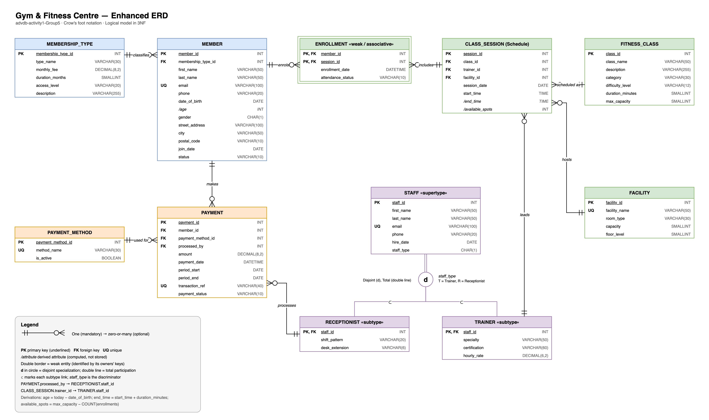

# advdb-activity1-Group5 — Gym & Fitness Centre Logical Database

Advanced Database, Activity 1 (Group 5). This is a logical data model for a local gym and fitness centre. The gym needs to manage its **members, staff and trainers, classes, schedules, facilities and payments**.

## Repository contents

| File | Description |
|---|---|
| [`images/Group5_Gym_EERD.png`](images/Group5_Gym_EERD.png) | Screenshot of the finished EERD |
| [`diagrams/gym_eerd.drawio`](diagrams/gym_eerd.drawio) | Editable EERD source (open at [app.diagrams.net](https://app.diagrams.net)) |
| [`docs/Group5_DataDictionary_TeamContributions.pdf`](docs/Group5_DataDictionary_TeamContributions.pdf) | Data dictionary and team contribution table |
| [`docs/Group5_DataDictionary_TeamContributions.html`](docs/Group5_DataDictionary_TeamContributions.html) | Source of the PDF |
| `README.md` | Business rules, design process and rationale (this file) |

## Modelling tool

The EERD was built in **draw.io (diagrams.net)** using **crow's foot notation**, with EER extensions for specialization, a weak entity and derived attributes. The `.drawio` source is included so the diagram can be opened and edited. The PNG is an export of the same file.

## Design process

1. **Understand the business.** We listed what the gym does every day: people sign up for a membership plan, pay for it, book group classes, and turn up to sessions run by trainers in specific rooms. Front-desk staff take the payments.
2. **Identify entities.** We picked out the main nouns in that description (Member, Trainer, Class, Payment). Then we added the supporting entities needed to avoid repeated data (MembershipType, PaymentMethod, Facility, ClassSession/Schedule).
3. **Write business rules.** We wrote down how the entities interact (see below). The rules gave us every relationship's cardinality and participation.
4. **Define attributes and keys.** Every entity got a surrogate primary key. Natural unique values such as e-mail and transaction reference became alternate (UQ) keys. Foreign keys implement the 1:M relationships.
5. **Resolve M:N relationships.** Members and class sessions are many-to-many, so we resolved them with the ENROLLMENT associative entity.
6. **Apply EER concepts.** Trainers and receptionists share most attributes, so we generalised them into a STAFF supertype with a disjoint, total specialization.
7. **Normalise to 3NF.** We checked every relation for repeating groups, partial dependencies and transitive dependencies, and moved data into its own entity where needed (see *Normalization*).
8. **Draw and document.** We drew the EERD in draw.io and wrote the data dictionary with data types and validation rules.

## Business rules

1. **Membership:** Each member holds exactly **one** membership type at a time. A membership type (e.g. Basic, Premium) can be held by **zero or many** members.
2. **Trainers lead classes:** Each trainer can lead **zero or many** class sessions. Each class session is led by exactly **one** trainer.
3. **Class scheduling:** Each fitness class can be scheduled as **zero or many** class sessions. Each session belongs to exactly **one** class and is held in exactly **one** facility. A facility can host many sessions, but never two at overlapping times.
4. **Enrolment:** A member can enrol in **zero or many** class sessions, and a session can have **zero or many** enrolled members. A member can enrol in the same session only once, and a session's enrolments cannot exceed the class's `max_capacity`.
5. **Payments:** Each payment is made by exactly **one** member using exactly **one** payment method and is recorded by exactly **one** receptionist. A member can make **zero or many** payments.
6. **Staff specialization:** Every staff member is **either** a trainer **or** a receptionist, never both and never neither (disjoint, total specialization).

## Entities

**Main entities:** `MEMBER`, `TRAINER`, `FITNESS_CLASS`, `PAYMENT`

**Additional entities:**

| Entity | Why it was added |
|---|---|
| `MEMBERSHIP_TYPE` | Stores plan name, fee and duration once instead of repeating them for every member |
| `PAYMENT_METHOD` | Lookup table so method names are not repeated in every payment row |
| `FACILITY` | Rooms have their own attributes (capacity, floor) that don't depend on a class |
| `CLASS_SESSION` (Schedule) | Separates *what* a class is from *when/where/who* runs each occurrence |
| `ENROLLMENT` | Resolves the M:N relationship between members and class sessions |
| `STAFF` (supertype) | Holds attributes shared by trainers and receptionists |
| `RECEPTIONIST` (subtype) | Front-desk staff who process payments |

## Attributes and keys

PK = primary key, FK = foreign key, UQ = unique, `/attr` = derived (not stored).

| Entity | Primary key | Foreign keys | Other attributes |
|---|---|---|---|
| MEMBERSHIP_TYPE | membership_type_id | — | type_name, monthly_fee, duration_months, access_level, description |
| MEMBER | member_id | membership_type_id → MEMBERSHIP_TYPE | first_name, last_name, email (UQ), phone, date_of_birth, `/age`, gender, street_address, city, postal_code, join_date, status |
| PAYMENT_METHOD | payment_method_id | — | method_name (UQ), is_active |
| PAYMENT | payment_id | member_id → MEMBER; payment_method_id → PAYMENT_METHOD; processed_by → RECEPTIONIST | amount, payment_date, period_start, period_end, transaction_ref (UQ), payment_status |
| STAFF | staff_id | — | first_name, last_name, email (UQ), phone, hire_date, staff_type (discriminator) |
| TRAINER | staff_id | staff_id → STAFF | specialty, certification, hourly_rate |
| RECEPTIONIST | staff_id | staff_id → STAFF | shift_pattern, desk_extension |
| FITNESS_CLASS | class_id | — | class_name, description, category, difficulty_level, duration_minutes, max_capacity |
| FACILITY | facility_id | — | facility_name (UQ), room_type, capacity, floor_level |
| CLASS_SESSION | session_id | class_id → FITNESS_CLASS; trainer_id → TRAINER; facility_id → FACILITY | session_date, start_time, `/end_time`, `/available_spots` |
| ENROLLMENT | (member_id, session_id) | member_id → MEMBER; session_id → CLASS_SESSION | enrollment_date, attendance_status |

The full data types, definitions and validation rules are in the [data dictionary PDF](docs/Group5_DataDictionary_TeamContributions.pdf).

## Relationships, cardinality and participation

| Relationship | Type | Cardinality (min..max) | Participation |
|---|---|---|---|
| MEMBERSHIP_TYPE *classifies* MEMBER | 1:M | type 1..1 — member 0..M | MEMBER total (every member has a plan); MEMBERSHIP_TYPE partial |
| MEMBER *makes* PAYMENT | 1:M | member 1..1 — payment 0..M | PAYMENT total; MEMBER partial |
| PAYMENT_METHOD *used for* PAYMENT | 1:M | method 1..1 — payment 0..M | PAYMENT total; PAYMENT_METHOD partial |
| RECEPTIONIST *processes* PAYMENT | 1:M | receptionist 1..1 — payment 0..M | PAYMENT total; RECEPTIONIST partial |
| FITNESS_CLASS *scheduled as* CLASS_SESSION | 1:M | class 1..1 — session 0..M | CLASS_SESSION total; FITNESS_CLASS partial |
| TRAINER *leads* CLASS_SESSION | 1:M | trainer 1..1 — session 0..M | CLASS_SESSION total; TRAINER partial |
| FACILITY *hosts* CLASS_SESSION | 1:M | facility 1..1 — session 0..M | CLASS_SESSION total; FACILITY partial |
| MEMBER *enrols in* CLASS_SESSION | **M:N** via ENROLLMENT | member 0..M — session 0..M | Both partial; ENROLLMENT total on both sides (identifying) |
| STAFF → TRAINER / RECEPTIONIST | Specialization (1:1 per subtype) | — | **Disjoint (d), total** |

### EER features used

- **Specialization:** `STAFF` is the supertype of `TRAINER` and `RECEPTIONIST`. The specialization is **disjoint** (a staff member cannot be both) and **total** (every staff member must be one of them). `staff_type` ('T'/'R') is the discriminator. Subtypes share the supertype's primary key (`staff_id` is both PK and FK).
- **Weak / associative entity:** `ENROLLMENT` has no key of its own. It is identified by the combination of its owners' keys `(member_id, session_id)`, so it is drawn with a double border. Using the composite PK also enforces the "enrol only once per session" rule.
- **Derived attributes:** `MEMBER./age` (from `date_of_birth`), `CLASS_SESSION./end_time` (`start_time + duration_minutes`) and `CLASS_SESSION./available_spots` (`max_capacity − number of enrolments`). They are computed at query time, not stored, so they can never go stale.

## Normalization (up to 3NF)

**1NF: atomic values, no repeating groups**
- We split the member's address into `street_address`, `city` and `postal_code` instead of one free-text field. Names are split into `first_name` and `last_name`.
- A member can attend many classes, but we store no list of classes on `MEMBER`. Each booking is its own row in `ENROLLMENT`.

**2NF: no partial dependencies on a composite key**
- `ENROLLMENT` is the only table with a composite key. Its non-key attributes (`enrollment_date`, `attendance_status`) depend on the **whole** key (this member *in* this session). Member names and class names were deliberately kept out because they depend on only part of the key.

**3NF: no transitive dependencies**
- **Membership fee separated from member:** In a single member table, `member_id → membership_type → monthly_fee, duration_months` would be a transitive dependency. Plan details were moved to `MEMBERSHIP_TYPE`, so a fee change is made in one row.
- **Separated payment method from payment details:** Method names were moved into `PAYMENT_METHOD` and referenced by FK. This avoids repeating "Credit Card" in thousands of rows and prevents spelling variations.
- **Class details separated from the schedule:** In a single schedule table, `session_id → class_id → class_name, difficulty_level, max_capacity` would be transitive. `FITNESS_CLASS` holds the class definition, and `CLASS_SESSION` holds only when/where/who.
- **Facility details separated:** `facility_id → capacity, floor_level` lives in `FACILITY`, not in every session row.
- **`end_time` not stored:** `end_time` is determined by `start_time` and the class's `duration_minutes`, so storing it would create a transitive dependency and a possible inconsistency. It is a derived attribute. The same applies to `available_spots` and `age`.
- **Staff generalisation:** Name, e-mail, phone and hire date are shared by trainers and receptionists, so they are stored once in `STAFF`. Only role-specific attributes live in the subtypes, which avoids nullable columns and duplicate structures.

**Deliberate decisions (why some data *looks* duplicated but isn't)**
- **`PAYMENT.amount` is stored** even though `MEMBERSHIP_TYPE.monthly_fee` exists. The amount is a historical fact about what was actually paid (discounts, fee changes, partial payments), so it does not functionally depend on the current plan fee.
- **`city` / `postal_code` kept on `MEMBER`:** Postal codes do not reliably determine a single city in every country, so we did not treat `postal_code → city` as a functional dependency. A separate location table would add complexity without real benefit at this scale.

## Team contributions

The full team contribution table (names, roles and specific tasks) is in [`docs/Group5_DataDictionary_TeamContributions.pdf`](docs/Group5_DataDictionary_TeamContributions.pdf).

| Team member | Role |
|---|---|
| [Team member 1 name] | Project Lead / Business Analyst |
| [Team member 2 name] | Data Modeller |
| [Team member 3 name] | EERD Designer |
| [Team member 4 name] | Normalization Analyst |
| [Team member 5 name] | Documentation Lead |
