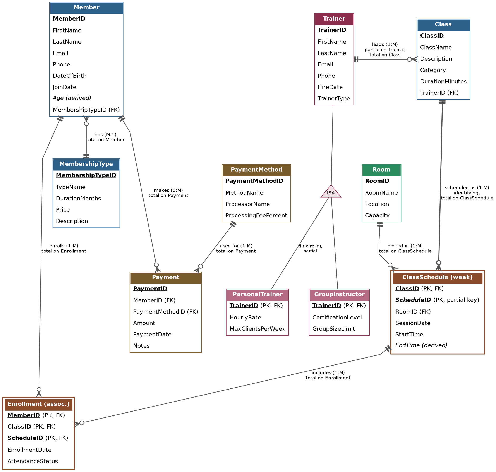

# Gym & Fitness Centre Management System

**Logical Database Design & Enhanced Entity-Relationship Diagram (EERD)**

| | |
|---|---|
| **Course activity:** | Advanced Database — Activity 1: Logical Database Design |
| **Group:** | Group 5 |
| **Team members:** | Hidalgo Altesse Imena, Noah Jobse, Melody Shih |
| **Modelling tool used:** | Graphviz (crow's-foot notation, EER extensions) for the EERD; Markdown for documentation |
| **Repository:** | advdb-activity1-Group5 |

**Files in this repository**

- [`images/EERD_Group5.png`](images/EERD_Group5.png) — EERD image
- [`docs/Gym_DB_Design_Report_Group5.pdf`](docs/Gym_DB_Design_Report_Group5.pdf) — Report including the data dictionary and team contributions
- `README.md` — Business rules, design and rationale

## 1. Design Process

We started from the scenario's core operations — managing members, trainers, classes, and payments — and identified the nouns that needed to persist data as candidate entities. We then walked through the day-to-day questions the gym would need to answer (Who can lead this class? What times does it run? Who is enrolled? Has this member paid?) to surface the relationships and constraints between entities. Attributes were assigned to whichever entity they functionally depend on, primary keys were chosen as single-column surrogate identifiers for stability (except for the weak entity ClassSchedule and the associative entity Enrollment, whose composite keys include the keys of the entities they depend on), and foreign keys were added everywhere a relationship needed to be enforced. The model was then normalized to third normal form (3NF) to remove repeating groups and update anomalies (see Section 3). The final logical model was drawn as an Enhanced ER Diagram (EERD) in Graphviz using crow's-foot cardinality notation, an ISA triangle for the trainer specialization, and double-bordered boxes for the two weak/associative entities.

## 2. Entities and Business Rules

**Main entities:** Member, Trainer (specialized into PersonalTrainer and GroupInstructor), Class, Payment.

**Additional supporting entities:** MembershipType (plan pricing/duration), Room (facility used to host a class session), ClassSchedule (a specific date/time/room a class runs — weak entity), Enrollment (associative entity resolving the Member–ClassSchedule many-to-many relationship), and PaymentMethod (separated out to satisfy 3NF, see Section 3).

### Business rules

1. Every member must belong to exactly one membership type at a time; a membership type can be held by many members (Member is on the “many” side, total participation — a member cannot exist without a plan).
2. A trainer can lead many classes, but each class is led by exactly one trainer. Trainers are specialized as either a Personal Trainer or a Group Instructor (disjoint, partial specialization — a trainer row is not required to belong to a subtype, e.g. a newly hired trainer awaiting certification).
3. A class can run as many separate scheduled sessions (different dates, times, and rooms); each schedule entry belongs to exactly one class and cannot exist without it, making ClassSchedule a weak entity identified by (ClassID, ScheduleID), where ScheduleID is a partial key that numbers the sessions within each class.
4. A member can enroll in many class schedules, and a class schedule can hold many enrolled members. This many-to-many relationship is resolved through the Enrollment associative entity, which also records the enrollment date and attendance status.
5. Each payment is made by exactly one member using exactly one payment method; a member can make many payments over time, and a given payment method can be reused across many payments.
6. A room can host many class schedules over time, but a single class schedule takes place in exactly one room at one time slot (double-booking a room for overlapping times is prevented at the application layer).

## 3. Normalization to 3NF — Key Decisions

- **Repeating class-session columns removed (1NF).** An early draft stored each class's sessions as repeating columns on Class (Day1/Time1, Day2/Time2 …). This violates 1NF. We extracted a separate ClassSchedule entity with one row per session instead.
- **MembershipType separated from Member (3NF).** Plan price and duration were originally copied onto every Member row. Since Price and DurationMonths depend on the plan, not on the individual member, leaving them on Member created a transitive dependency and an update anomaly (changing a plan's price would require updating every member on that plan). We moved them into their own MembershipType entity.
- **Payment method details separated from Payment (3NF).** Processor name and processing-fee percentage depend on the payment method chosen, not on the specific payment transaction — a transitive dependency on a non-key attribute. We split this into a PaymentMethod lookup entity referenced by Payment via PaymentMethodID.
- **Member–ClassSchedule many-to-many resolved with an associative entity.** Because the relationship itself carries data (EnrollmentDate, AttendanceStatus), it cannot be represented as a plain M:N line; we created the Enrollment entity with a composite key (MemberID, ClassID, ScheduleID).
- **Room kept independent of ClassSchedule.** RoomName, Location, and Capacity depend only on the room, not on any one scheduled session, so keeping Room separate avoids repeating room details for every session held there.
- **EndTime derived instead of stored (3NF).** A session's end time is determined by its StartTime and the class's DurationMinutes, so storing EndTime on ClassSchedule would create a transitive dependency and risk inconsistent values. EndTime is therefore a derived attribute, computed at query time.
- After these changes, every non-key attribute in every entity depends on the whole primary key and nothing else, satisfying 3NF.

## 4. Enhanced Entity-Relationship Diagram (EERD)

Notation: rectangles are entities (primary keys underlined, foreign keys marked “FK”); double-bordered rectangles are weak/associative entities, and the partial key of the weak entity is shown in italics and marked “partial key”; crow's-foot line endings show cardinality and participation (a fanned-out end = “many”, a perpendicular bar = “one”, a double bar = “exactly one”, a circle = “zero”/optional); the thicker line marks the identifying relationship; attributes in italics marked “(derived)” are derived attributes; the triangle labelled “ISA” shows the disjoint (d), partial specialization of Trainer into PersonalTrainer and GroupInstructor.

## 5. Data Dictionary

| Entity | Attribute | Definition | Data Type | Validation / Rule |
|---|---|---|---|---|
| **MembershipType** | MembershipTypeID (PK) | Unique identifier for a membership plan. | Integer | Auto-increment; not null |
| **MembershipType** | TypeName | Name of the plan (e.g., Basic, Premium, Student). | Varchar(30) | Not null; unique |
| **MembershipType** | DurationMonths | Length of the plan in months. | Integer | > 0 |
| **MembershipType** | Price | Cost of the plan for its duration. | Decimal(8,2) | >= 0 |
| **MembershipType** | Description | Short description of plan benefits. | Varchar(255) | Optional |
| **Member** | MemberID (PK) | Unique identifier for a gym member. | Integer | Auto-increment; not null |
| **Member** | FirstName | Member's first name. | Varchar(50) | Not null |
| **Member** | LastName | Member's last name. | Varchar(50) | Not null |
| **Member** | Email | Contact email, used for login/notifications. | Varchar(100) | Not null; unique; valid email format |
| **Member** | Phone | Contact phone number. | Varchar(20) | Optional; numeric format |
| **Member** | DateOfBirth | Member's date of birth. | Date | Not null; must be in the past |
| **Member** | JoinDate | Date the member joined the gym. | Date | Not null; defaults to current date |
| **Member** | Age (derived) | Current age, calculated from DateOfBirth. | Integer (derived) | Not stored; computed at query time |
| **Member** | MembershipTypeID (FK) | References the member's current plan. | Integer | Not null; must exist in MembershipType |
| **Trainer** | TrainerID (PK) | Unique identifier for a trainer. | Integer | Auto-increment; not null |
| **Trainer** | FirstName | Trainer's first name. | Varchar(50) | Not null |
| **Trainer** | LastName | Trainer's last name. | Varchar(50) | Not null |
| **Trainer** | Email | Contact email. | Varchar(100) | Not null; unique |
| **Trainer** | Phone | Contact phone number. | Varchar(20) | Optional |
| **Trainer** | HireDate | Date the trainer was hired. | Date | Not null |
| **Trainer** | TrainerType | Discriminator: 'Personal' or 'Group', or null if unassigned. | Varchar(10) | Optional (partial specialization) |
| **PersonalTrainer** | TrainerID (PK, FK) | Links to the specialized trainer record. | Integer | Must exist in Trainer |
| **PersonalTrainer** | HourlyRate | Rate charged per one-on-one session. | Decimal(6,2) | > 0 |
| **PersonalTrainer** | MaxClientsPerWeek | Cap on weekly one-on-one clients. | Integer | > 0 |
| **GroupInstructor** | TrainerID (PK, FK) | Links to the specialized trainer record. | Integer | Must exist in Trainer |
| **GroupInstructor** | CertificationLevel | Instructor's certification tier. | Varchar(30) | Not null |
| **GroupInstructor** | GroupSizeLimit | Max participants the instructor can supervise. | Integer | > 0 |
| **Class** | ClassID (PK) | Unique identifier for a class offering. | Integer | Auto-increment; not null |
| **Class** | ClassName | Name of the class (e.g., Spin, Yoga). | Varchar(50) | Not null |
| **Class** | Description | Overview of what the class covers. | Varchar(255) | Optional |
| **Class** | Category | Category/type of workout. | Varchar(30) | Not null |
| **Class** | DurationMinutes | Length of one session in minutes. | Integer | > 0 |
| **Class** | TrainerID (FK) | Trainer assigned to lead the class. | Integer | Not null; must exist in Trainer |
| **Room** | RoomID (PK) | Unique identifier for a facility room. | Integer | Auto-increment; not null |
| **Room** | RoomName | Name/number of the room. | Varchar(30) | Not null |
| **Room** | Location | Location within the facility. | Varchar(50) | Optional |
| **Room** | Capacity | Maximum occupancy of the room. | Integer | > 0 |
| **ClassSchedule** | ClassID (PK, FK) | Class this session belongs to (owner of the weak entity). | Integer | Not null; must exist in Class |
| **ClassSchedule** | ScheduleID (PK, partial key) | Number of the session within its class (1, 2, 3 …); unique only together with ClassID. | Integer | Not null; > 0; (ClassID, ScheduleID) unique |
| **ClassSchedule** | RoomID (FK) | Room the session is held in. | Integer | Not null; must exist in Room |
| **ClassSchedule** | SessionDate | Date the session takes place. | Date | Not null |
| **ClassSchedule** | StartTime | Session start time. | Time | Not null |
| **ClassSchedule** | EndTime (derived) | Session end time, calculated as StartTime + Class.DurationMinutes. | Time (derived) | Not stored; computed at query time |
| **Enrollment** | MemberID (PK, FK) | Member enrolled in the session. | Integer | Not null; must exist in Member |
| **Enrollment** | ClassID (PK, FK) | Class of the scheduled session the member enrolled in. | Integer | Not null; (ClassID, ScheduleID) must exist in ClassSchedule |
| **Enrollment** | ScheduleID (PK, FK) | Scheduled session the member enrolled in. | Integer | Not null; (ClassID, ScheduleID) must exist in ClassSchedule |
| **Enrollment** | EnrollmentDate | Date the member enrolled. | Date | Not null; defaults to current date |
| **Enrollment** | AttendanceStatus | Attendance outcome for the session. | Varchar(15) | One of Registered/Attended/No-show/Cancelled |
| **PaymentMethod** | PaymentMethodID (PK) | Unique identifier for a payment method. | Integer | Auto-increment; not null |
| **PaymentMethod** | MethodName | Name of the method (Credit Card, Cash, E-transfer). | Varchar(20) | Not null |
| **PaymentMethod** | ProcessorName | Third-party processor, if any. | Varchar(30) | Optional (e.g., null for Cash) |
| **PaymentMethod** | ProcessingFeePercent | Fee percentage charged by the processor. | Decimal(4,2) | >= 0 |
| **Payment** | PaymentID (PK) | Unique identifier for a payment transaction. | Integer | Auto-increment; not null |
| **Payment** | MemberID (FK) | Member who made the payment. | Integer | Not null; must exist in Member |
| **Payment** | PaymentMethodID (FK) | Method used for this payment. | Integer | Not null; must exist in PaymentMethod |
| **Payment** | Amount | Amount charged. | Decimal(8,2) | > 0 |
| **Payment** | PaymentDate | Date/time the payment was made. | Datetime | Not null; defaults to current timestamp |
| **Payment** | Notes | Optional free-text note. | Varchar(255) | Optional |

## 6. Team Contribution Table

| Team Member | Role | Specific Tasks |
|---|---|---|
| **Hidalgo Altesse Imena** | Database Designer / EERD Lead | Identified entities and business rules; defined attributes, keys, and relationships; carried out 3NF normalization; built the EERD; assembled the GitHub repository and this report. |
| **Noah Jobse** | Documentation & Business Rules | Drafted business rules; wrote/reviewed the README design rationale; reviewed relationship cardinalities. |
| **Melody Shih** | Data Dictionary & QA | Compiled the data dictionary; validated attribute data types and rules; proofread the final report. |
